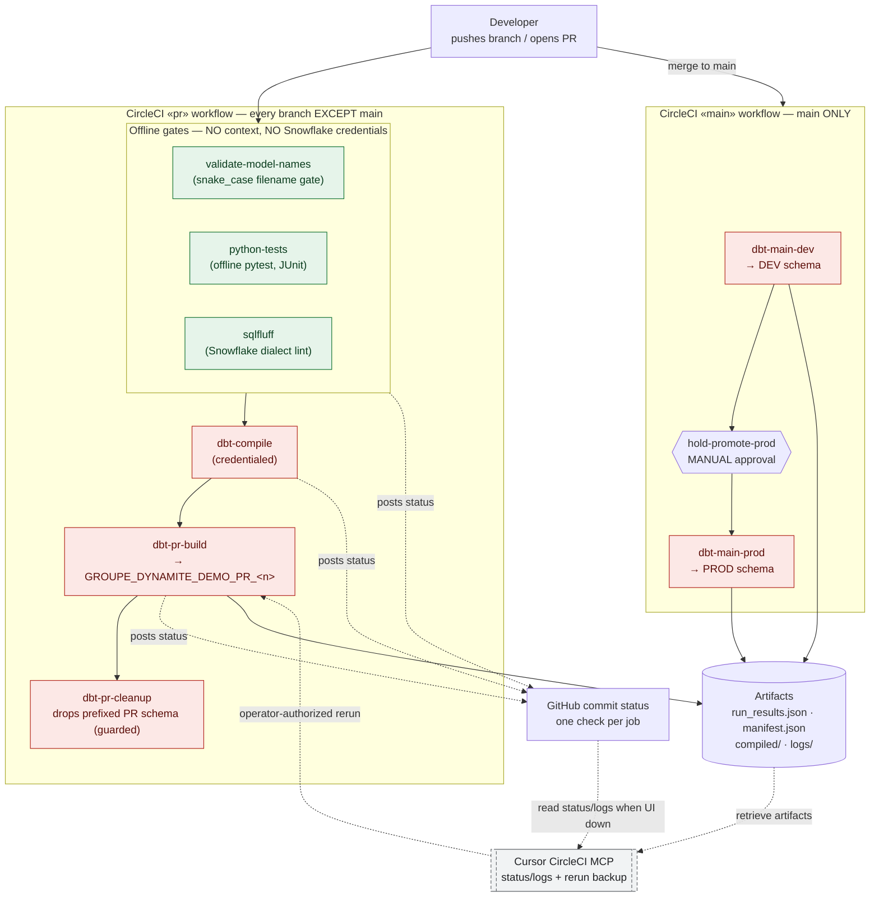

# Environment architecture

Two branch-selected CircleCI workflows drive one dbt Core project against one
Snowflake database. Credentials live **only** in the `snowflake-dbt-demo`
context and attach **only** to the five jobs that touch Snowflake. The Cursor
CircleCI MCP is a **backup** for retrieving status/logs and requesting a rerun
when the web UI is unavailable — it is never the primary flow and never edits code.

## How to read it

- **Developer → PR.** Any branch except `main` runs the `pr` workflow. The
  developer never handles Snowflake credentials.
- **Separate checks.** The three offline gates (`validate-model-names`,
  `python-tests`, `sqlfluff`) run **without** the context. An unsafe change is
  caught here **before** any credential is loaded — this is the "blocked unsafe
  PR" moment.
- **PR schema.** `dbt-pr-build` materialises into a disposable, deterministic
  `GROUPE_DYNAMITE_DEMO_PR_<…>` schema. Concurrent PRs never collide.
- **GitHub status.** CircleCI posts one commit status per job back to the PR.
  These red/green checks are the merge signal. See
  [rehearsal-status.md](rehearsal-status.md) for the branch-protection
  entitlement caveat on this personal-account repo.
- **main DEV → approval → PROD.** Merging to `main` builds into
  `GROUPE_DYNAMITE_DEMO_DEV`, pauses at `hold-promote-prod`, then builds into
  `GROUPE_DYNAMITE_DEMO_PROD`. One branch, one promotion path.
- **Artifacts.** `run_results.json`, `manifest.json`, `compiled/`, and `logs/`
  are stored after the build step (`when: always`), so they persist even when
  `dbt build` fails — that is what makes a failure *actionable*.
- **Cursor CircleCI MCP — backup only.** Used **after** the core demo, or if the
  CircleCI UI is unavailable, to read pipeline status/logs, retrieve artifacts,
  and request a rerun after a human applies the fix. It never edits code. See
  [mcp-backup-flow.md](mcp-backup-flow.md).

## Credential boundary (must stay true)

| Jobs | Context `snowflake-dbt-demo`? | Touches Snowflake? |
|------|:---:|:---:|
| `validate-model-names`, `python-tests`, `sqlfluff` | ❌ no | ❌ no |
| `dbt-compile`, `dbt-pr-build`, `dbt-pr-cleanup` | ✅ yes | ✅ yes |
| `dbt-main-dev`, `dbt-main-prod` | ✅ yes | ✅ yes |

`DBT_SCHEMA` is set by CI to a fully prefixed PR, DEV, or PROD schema.
